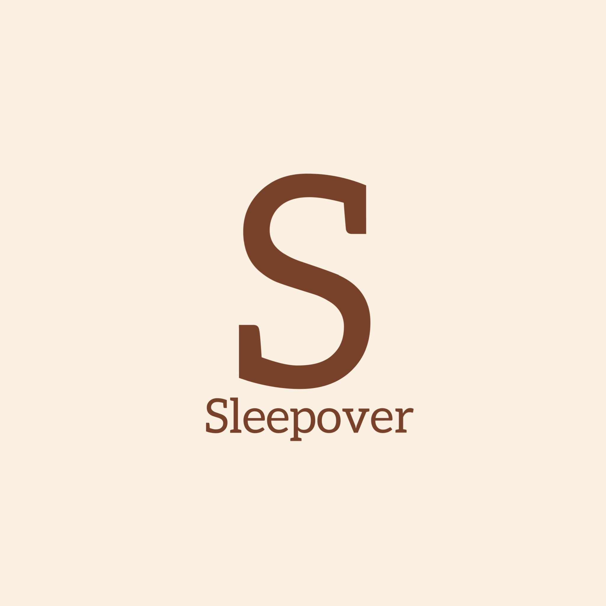
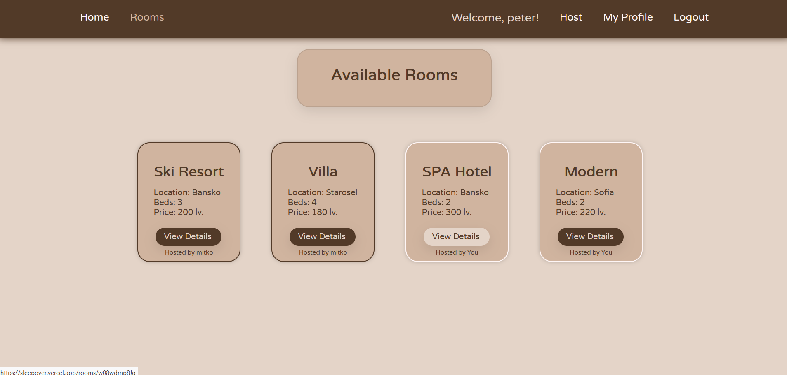
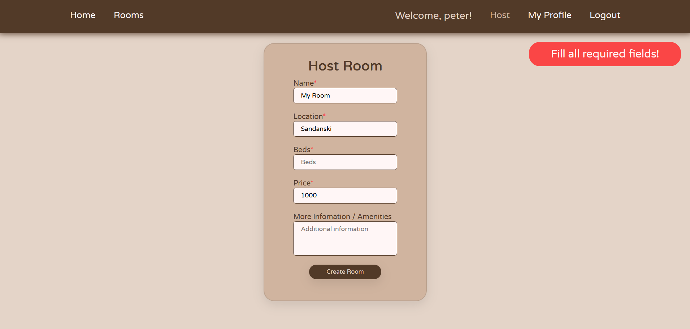
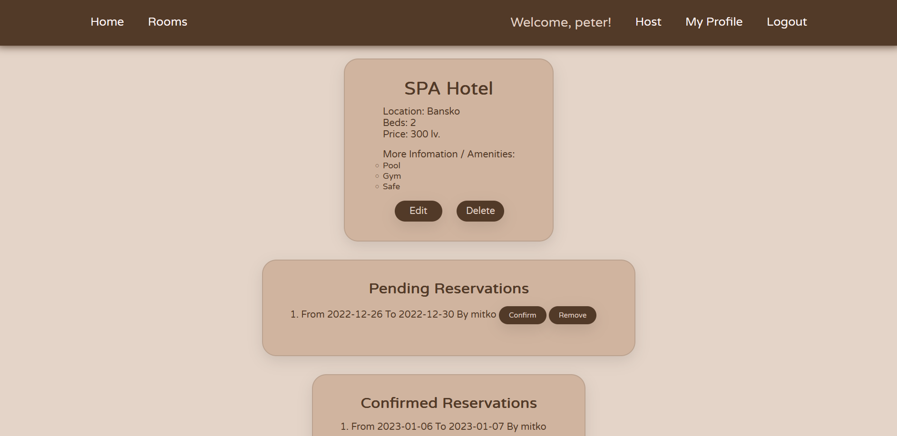
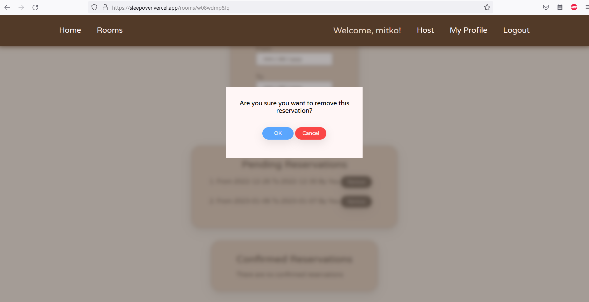

# Sleepover  

Find accommodation in many locations across the world or offer a room!

## Live demo - https://sleepover.vercel.app/

## Free User
That's regular user, just to try faster functionalities, you can create your account.
- email - user@abv.bg
- password - 123

## Technologies: 
- JavaScript
  - page.js
  - lit-html
- Back4app
- HTML
- CSS

## What can the user do?

### Not logged
- can view rooms and details
- can login or register

### Logged - all CRUD operations
- can be a host and user - guest
- user - guest
  - can host a room
  - can book a room
  - can remove pending reservations
  - can view his pending and confirmed reservations for current room
  - can view all his own rooms and profile
  - can logout
- host
  - can edit or delete room
  - can confirm or remove pending reservations
  - can view confirmed reservations from all users for room

## Features
- guards for rights
- preload data
- modal
- notifications
- disabled button after click
- spinner
- active bar
- and more

## Screenshots

